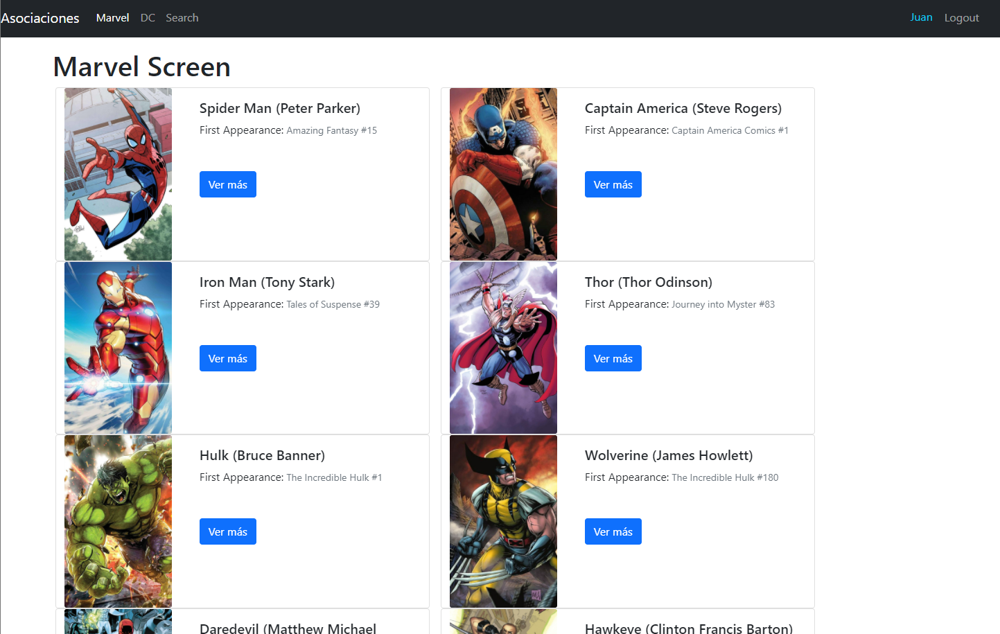
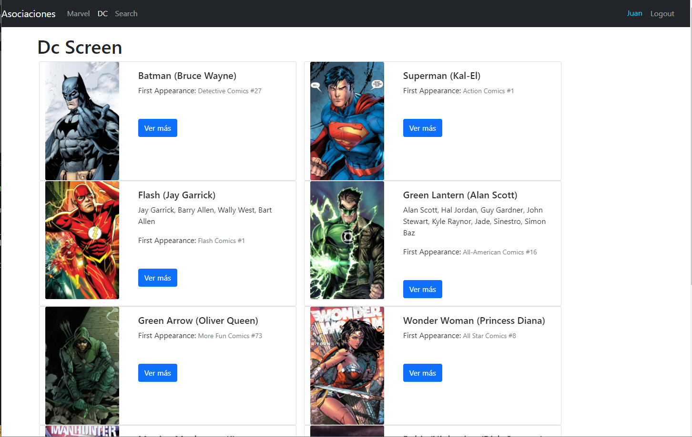
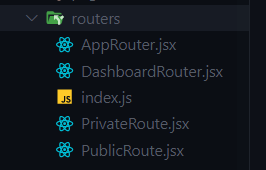

# Heros-APP

Is an app that allows you to see a catalog of characters from DC Comics and Marvel, having information about each one




## Dependencies

````json
    "@testing-library/jest-dom": "^5.11.4",
    "@testing-library/react": "^11.1.0",
    "@testing-library/user-event": "^12.1.10",
    "query-string": "^7.0.1",
    "react": "^17.0.2",
    "react-dom": "^17.0.2",
    "react-router-dom": "^6.0.1",
    "react-scripts": "4.0.3",
    "web-vitals": "^1.0.1"
    ```
````

## AUTH

I handle simple authentication using React Hooks' UseContext and UseReducer hooks, saving the information to Local Storage.


### AuthContext:

```jsx
import { createContext } from 'react';

export const AuthContext = createContext();
```

### AuthReducer:

```jsx
import { types } from '../types/index';

export const authReducer = (state = {}, action) => {
  switch (action.type) {
    case types.login:
      return {
        ...action.payload,
        logged: true,
      };
    case types.logout:
      return {
        logged: false,
      };
    default:
      return state;
  }
};
```

## Routers

I handle route protection, creating public routes that the user can mave without being logged in and private routes that can only access once it is logged, also create two routers one for the app one for the dashboard so different styles are handled in the login and in the dashboard. using version 6 of react-router-dom



### PrivateRoute:

```jsx
import { useContext } from 'react';
import { Navigate, useLocation } from 'react-router-dom';

import { AuthContext } from '../auth/AuthContext';

export const PrivateRoute = ({ children }) => {
  const { user } = useContext(AuthContext);

  const { pathname, search } = useLocation();

  localStorage.setItem('lastPath', pathname + search);

  return user.logged ? children : <Navigate to='/login' />;
};
```

### PublicRoute:

```jsx
import { useContext } from 'react';
import { Navigate } from 'react-router-dom';

import { AuthContext } from '../auth/AuthContext';

export const PublicRoute = ({ children }) => {
  const { user } = useContext(AuthContext);
  console.log(user);

  return user.logged ? <Navigate to='./login' /> : children;
};
```

## Configuration

- clone the project: https://github.com/LeoRincon/Heros-APP
- install dependencies: _npm i_ or _yarn add_
- run the app: _npm run start_ or _yarn start_
- run the tests: _`npm test`_ or _`yarn test`_
- link to deployed project: https://heros-app-react.netlify.app/login

## Testing

The tests carried out were integration into components, calls and structure

## This project is the final result of the ReactJS course taught by Fernando Herrera
